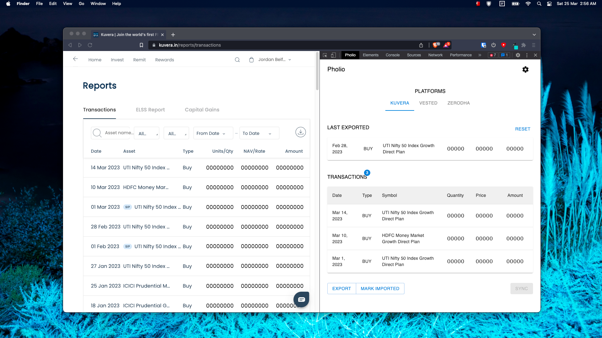

  

<h1 align="center" style="margin-top: 0px;">Pholio</h1>

Aggregate all your Investments data from different platforms (browser extension)

 

  

 

## Roadmap 

### v1.0.0

Investment Platforms supported for Export
- [Kuvera](https://kuvera.in/)
- [Zerodha](https://console.zerodha.com/)
- [Vested](https://app.vestedfinance.com/)

Portfolio Management Tools supported for Import
- [Ghostfolio](https://ghostfol.io/) ([_github_](https://github.com/ghostfolio/ghostfolio))

## Usage

### Installing Extension
- [Wiki guide](https://github.com/6ameDev/pholio/wiki/Chromium-unpacked-installation)

### Opening Extension
- Go to any tab in the browser
- Open Inspect (DevTools window)
- Go to the tab in Inspect/DevTools window with the name Pholio
